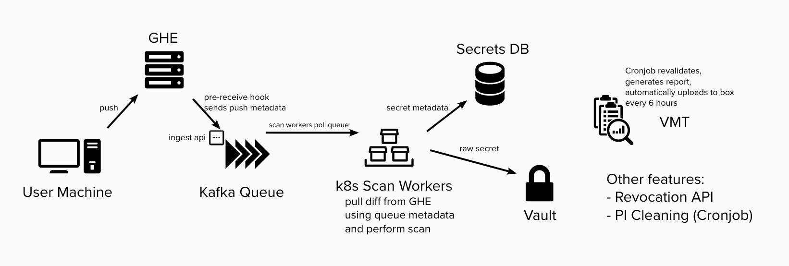

# Detect Secrets Stream [](https://travis.ibm.com/git-defenders/detect-secrets-stream)

## Description

Detect secrets stream is the server tool which ingests meta data of all (public repo by default, private repo opt-in) git pushes happened on github.ibm.com. For each push, it [scans](https://github.ibm.com/Whitewater/whitewater-detect-secrets/wiki/About-Detect-Secrets#what-file-content-do-you-scan) the push content for secrets. Once found and verified, secrets will be stored in db (meta data) and SoS vault (raw secret).

The live secrets are reported to Vulnerability Management team (VMT). Currently the reporting is through csv file uploaded in shared box folder. We are about to change to [report through read-only DB table](https://github.ibm.com/git-defenders/detect-secrets-discuss/issues/310).

There is another companion [Admin tool](https://github.ibm.com/Whitewater/whitewater-detect-secrets/wiki/Admin-Tool-FAQ) which enables org admin to

- opt-in their private repo for scanning
- add security folk for leak token notification.

Under the hood, server tool uses developer tool to scan for secrets. Read [Whitewater/whitewater-detect-secrets](https://github.ibm.com/Whitewater/whitewater-detect-secrets) for more info about developer tool.

## Architecture



## Development

### Tool dependencies

- python3
  - If you are using macOs, you can use `pyenv` to install Python 3 `brew install pyenv; pyenv install 3.8.5;`
  - Optionally, you can setup your system default Python as Python 3 `pyenv global 3.8.5`. Then restart your shell. Run `python --version` to validate the default python is 3 now.
- docker https://docs.docker.com/get-docker/
- docker-compose installed along with docker
- skaffold, v1.12.1 and above
- kustomize, v3.8.1 and above. Do **NOT** use the version bundled with kubectl, it does not support some options we use (e.g. replicas).
- container-structure-test, used for docker image validation - [installation](https://github.com/GoogleContainerTools/container-structure-test#installation).
- pipenv, used to manage all Python dependencies.

You can install all the tools except docker and python 3 with one liner below

```shell
brew install kustomize skaffold container-structure-test pipenv
```

### Python package dependencies

- Navigate into the clone repo
- Start pipenv shell with `pipenv shell`
- Install python dependencies with `pipenv install --dev`
- Initialize the pre-commit tool with `pre-commit install`

## Secret Management

We use [git-crypt](https://github.com/AGWA/git-crypt) to manage the secrets stored in this repo. To decrypt the secrets you need to

1. Install the git-crypt CLI

   ```sh
   brew install git-crypt
   ```

2. Download the git-crypt encryption key to local as `<local_secret_key_file>`. IBM Cloud Key Protect is used to store encryption key. The access is only provided to detect-secrets admin.

   ```sh
   detect_secrets_stream/key-protect/get_key.sh git-crypt-key <local_secret_key_file>
   ```

3. unlock the encryption

   ```sh
   git-crypt unlock <local_secret_key_file>
   ```

## Tests

### Unit tests

You don't need to unlock secrets when running unit tests.

```shell
make test
```

#### Run just unit test

```shell
make test-unit
```

#### Run a subset of unit tests.

It provides faster feedback if you are just writing code for a module.

```shell
# The part after last dash (-) corresponding to folder name under detect_secrets_stream
# For example, run unit test for just files under bp_lookup
make test-unit-bp_lookup
# Run unit test for just files under pi_cleaner
make test-unit-pi_cleaner
```

### End 2 end test

This requires a personal env or staging env. See [kustomize_envs/dev/README.md](kustomize_envs/dev/README.md) for more details.

## Utilities

This repo has provided a utility module which enables admin to do many routine tasks. The utility is invoked though `python -m detect_secrets_stream.util.secret_util`

Running the utility requires several environment variables. You would first unlock secrets with `git-crypt` (secret management section above), then export required environment variables. One example env var file `.env.example` has been prepared to help you.

In `fish` shell, you can do something like below

```shell
cp .env.example .env.prod
env (grep -v '^#' .env.prod | xargs -n1) python -m detect_secrets_stream.util.secret_util --help
```

### Decrypt raw tokens

Based on id

```shell
python -m detect_secrets_stream.util.secret_util decrypt-token-by-id [token_id]
```

Based on UUID

```shell
python -m detect_secrets_stream.util.secret_util decrypt-token-by-uuid [uuid]
```

### Validating Admin Tool Org Admins

```bash

python -m detect_secrets_stream.util.secret_util get-org-admins [ORG_NAME]
```

### Backfill tokens

```bash
# export require env vars

# macos
python -m detect_secrets_stream.util.secret_util backfill --size=10000 --from $(date -j -f "%a %b %d %T %Z %Y" "Wed Sep 11 00:00:00 EDT 2019" +"%s") --to $(date -j -
f "%a %b %d %T %Z %Y" "Wed Sep 12 00:00:00 EDT 2019" +"%s")

# linux
python -m detect_secrets_stream.util.secret_util backfill --size=10000 --from $(date -d '06/12/2012 07:21:22' +"%s") --to $(date -d '06/12/2012 08:21:22' +"%s")
```

### Manually ingest token

Manually add a commit to the `diff-scan` queue.

Note: must set `KAFKA_CLIENT_ID` , `GD_KAFKA_CONF` environment variables.

`KAFKA_CLIENT_ID` is the name of kafka client used in manual ingestion. It can be anything, such as `manual-ingest`
`GD_KAFKA_CONF` points to the Kafka configuration file. The production config is stored under `kustomize_envs/prod-secrets/secret/kafka.conf`. The one below is an example of what should be contained in the conf file.

```conf
[kafka]
brokers_sasl = my_sasl1.us-east.containers.appdomain.cloud:9000,my_sasl2.us-east.containers.appdomain.cloud:9000,my_sasl3.us-east.containers.appdomain.cloud:9000
api_key = my_api_key
```

Sample usage:

```bash
# export require env vars
python -m detect_secrets_stream.util.secret_util ingest-commit -r <repo> -c <commit>
```

More options: running the command above with `--help` will reveal help info on more options. For example, if you know the branch and repo visibility, you can also supply these.
By default it assumes the commit is from master granch and repo visibility is public.

### and more...

```shell
python -m detect_secrets_stream.util.secret_util --help
```

## PI Disposal Process

The mechanism for removing old secrets is a [cronjob]('/kustomize_envs/base/pi_cleaner/cronjob.yaml') which cleans PI on a daily basis.

It removes the following PI for all tokens that have been remediated for over seven days:

- Owner email
- Secret
- Encrypted secret
- Other factors
- Author name
- Author email
- Pusher username
- Pusher email
- Committer name
- Committer email
- Repo slug
- Location url

## Re-validation Process

Every four hours, a [cronjob]('/kustomize_envs/base/revalidation') checks if all live tokens in the database are still live and updates their statuses accordingly.

## PostgreSQL Database

### How to Create a Role

```sql
CREATE ROLE scan_worker_role;
GRANT SELECT, INSERT ON ALL TABLES IN SCHEMA public TO scan_worker_role;
GRANT ALL ON ALL SEQUENCES IN SCHEMA public TO scan_worker_role;
GRANT TRUNCATE ON TABLE public.vmt_report TO scan_worker_role;
```

### How to Provision a User with a Specific Role

```sql
CREATE ROLE vmt_role WITH LOGIN;
GRANT CONNECT ON DATABASE <db_name> TO vmt_role;
GRANT USAGE ON SCHEMA public TO vmt_role;
GRANT SELECT ON public.vmt_report TO vmt_role;

CREATE USER vmt_user WITH IN GROUP vmt_role PASSWORD [redacted]
```

### Table Schema: `vmt_report`

| Column name         | Type        | Description                                                              |
| ------------------- | ----------- | ------------------------------------------------------------------------ |
| `vuln_id`           | VARCHAR     | The vulnerability ID                                                     |
| `token_owner_email` | VARCHAR     | The token owner's email address                                          |
| `token_type`        | VARCHAR     | The type of token, such as 'Slack', 'GHE', Softlayer; (10 < types < 100) |
| `vulnerability`     | VARCHAR     | The vulnerability                                                        |
| `pusher_email`      | VARCHAR     | The commit pusher's email address                                        |
| `committer_email`   | VARCHAR     | The committer's email address                                            |
| `author_email`      | VARCHAR     | The author's email                                                       |
| `date_last_tested`  | TIMESTAMPTZ | The date that the token was last tested                                  |
| `date_remediated`   | TIMESTAMPTZ | The date the token was remediated                                        |
| `security_focals`   | VARCHAR     | The security focals                                                      |
| `repo_public`       | BOOLEAN     | Whether the token has been leaked in at least one public repository      |
| `repo_private`      | BOOLEAN     | Whether the token has been leaked in at least one private repository     |

## Wiki

See our [wiki](https://github.ibm.com/git-defenders/detect-secrets-discuss/wiki) for more useful information on managing this repo.

- [infrastructure info](https://github.ibm.com/git-defenders/detect-secrets-discuss/wiki/%5BAdmin%5D-Infrastructure-Information)
- [Operation guide](https://github.ibm.com/git-defenders/detect-secrets-discuss/wiki/%5BAdmin%5D-Operation-guide)
- [Admin Tool FAQ](https://github.ibm.com/git-defenders/detect-secrets-discuss/wiki/%5BAdmin%5D-DSS-Admin-FAQ), including the section about how to review [git-defenders/dss-config PRs](https://github.ibm.com/git-defenders/dss-config/pulls)

User facing doc are in [here](https://github.ibm.com/Whitewater/whitewater-detect-secrets/wiki)
