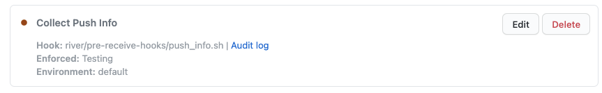

# GitHub Enterprise Site Admin FAQ

This documentation is intended for Detect Secrets Stream admins.

<!-- START doctoc generated TOC please keep comment here to allow auto update -->
<!-- DON'T EDIT THIS SECTION, INSTEAD RE-RUN doctoc TO UPDATE -->

- [As a site admin, how do I enable/disable the pre-receive hook?](#as-a-site-admin-how-do-i-enabledisable-the-pre-receive-hook)
- [How do I fix `Token pool exhausted` errors?](#how-do-i-fix-token-pool-exhausted-errors)
  - [Process for increasing pool](#process-for-increasing-pool)
- [As DSS admin, how do I review PRs in the detect secrets stream configuration repository?](#as-dss-admin-how-do-i-review-prs-in-the-detect-secrets-stream-configuration-repository)

<!-- END doctoc generated TOC please keep comment here to allow auto update -->

## As a site admin, how do I enable/disable the pre-receive hook?

First, log in to your company GitHub Enterprise instance as a site admin. Navigate to the Hooks page by clicking "Site Admin" -> "Admin Center -> "Hooks".

**For a site admin to enable the pre-receive hook:**

1. Uncheck `Use the exit-status to accept or reject pushes`
2. Uncheck `Enable this pre-receive hook on all repositories by default` (automatically unchecked after step 1)
3. Uncheck `Administrators can enable and disable this hook` (automatically unchecked after step 1)

This results in the hook being set to testing mode:

_Note: testing mode is non-blocking._

**For a site admin to disable the pre-receive hook**:

The only way to disable the pre-receive hook is to delete it.

## How do I fix `Token pool exhausted` errors?

In the monitoring channel, you may occasionally notice an alert along the lines of:

`Token pool exhausted. Remaining rate limit under # for all # tokens.`

This means the API calls needed by DSS for every hour has exceeded the combined allowed API requests for all tokens in token pool. Add more tokens to the token pool.

### Process for increasing pool

- Acquire more GHE personal access tokens using the service account
- Add the personal access token to the DSS secrets

## As DSS admin, how do I review PRs in the detect secrets stream configuration repository?

See "PR Approval Requirements" in the PR template, and check the following requirements:

1. Ensure that the CI build step for validating yaml file syntax has passed.
2. Ensure that all the organizations listed in the config file have the Detect Secrets Suite Admin Tool installed. This will become apparent in the next step.
3. Run the utility to lookup org admins for each GitHub organization in the config file, and ensure that at least one org admin from each organization has approved the PR. From the root of this repository, run `python -m detect_secrets_stream.util.secret_util get-org-admins <org-name>` to list org admins. If the app is not installed on the organization, you will see an error.
